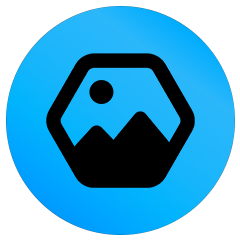
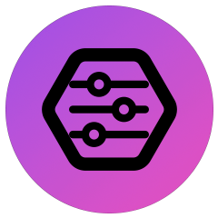

Hi, I am [Sebastian](https://sebastianhahner.de) 👋.
I am a postdoctoral researcher at [KIT Karlsruhe](https://dsis.kastel.kit.edu/staff_sebastian_hahner.php). I’m a [web video creator](https://youtube.com/skate702) since 2010. 
I studied computer science, I [stream live](https://twitch.tv/skate702) while coding, and I love playing around with new technologies.
On GitHub, you can find personal projects, live-developed streaming utilities and tools, and also all the research software we develop in the university.
My preferred languages are Java, Scala, C#, and TypeScript.

### Research Projects

<b>JPlag</b> 
World-leading open-source plagiarism detector to counter academic misconduct. I have led the development since 2020.

<b>Data Flow Analysis</b> 
Architecture-based confidentiality analysis framework for information security. I have led the development since 2022.

<b>ABUNAI</b> 
Architecture-based and uncertainty-aware confidentiality analysis, the research tooling I've developed during my dissertation.

### Personal Projects

<b>StreamAwesome</b> 
Simple yet versatile Elgato Stream Deck Icon Generator powered by Font Awesome, available <a href="https://skate702.de/StreamAwesome">online</a> for free!

<b>HotkeylessAHK</b> 
Enabling the execution of AutoHotkey without using hotkeys, thereby increasing both scalability and performance.

<b>PremiereRemote</b> 
Remote control Adobe Premiere Pro over the network, e.g., using external controller devices. Also see <a href="https://github.com/sebinside/PremiereClipboard">PremiereClipboard</a>.

