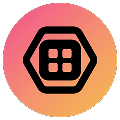

Hi, I am [Sebastian](https://sebastianhahner.de) 👋.
I am a software engineer in the automotive industry, a former postdoctoral researcher from [KIT Karlsruhe](https://dsis.kastel.kit.edu/staff_sebastian_hahner.php), and a [web video creator](https://youtube.com/skate702) since 2010.
I [studied computer science](https://podcasters.spotify.com/pod/show/skate702), I [stream live](https://twitch.tv/skate702) while coding, and I love playing around with new technologies and sharing [my passion for informatics](https://news.sebastianhahner.de/).
On GitHub, you can find personal projects, live-developed streaming utilities, and all the research software I developed during my time at the university.
My preferred languages are Java, Scala, C#, and TypeScript.

### Personal Projects

<b>StreamAwesome</b> 
Simple yet versatile Elgato Stream Deck Icon Generator powered by Font Awesome, available <a href="https://streamawesome.app">online</a> for free!

<b>HotkeylessAHK</b> 
Enabling the execution of AutoHotkey without using hotkeys, thereby increasing both scalability and performance.

<b>PremiereRemote</b> 
Remote control Adobe Premiere Pro over the network, e.g., using external controller devices. Also see <a href="https://github.com/sebinside/PremiereClipboard">PremiereClipboard</a>.

<b>ASDF</b> 
<i>Upcoming</i>: Advanced Stream Deck Features, short ASDF, showcasing the limits of Elgato Stream Decks!

<b>stubits</b> 
<i>Upcoming</i>: Simple to Use Broadcast Interaction Tiles from my own livestreams on Twitch - free for everyone.

### Research Projects

<b>JPlag</b> 
World-leading open-source plagiarism detector, countering academic misconduct. I led the development from 2020-2025.

<b>Data Flow Analysis</b> 
Architecture-based confidentiality analysis framework for information security. I led the development from 2022-2025.

<b>ABUNAI</b> 
Architecture-based and uncertainty-aware confidentiality analysis; the research tooling I've developed during my dissertation.

